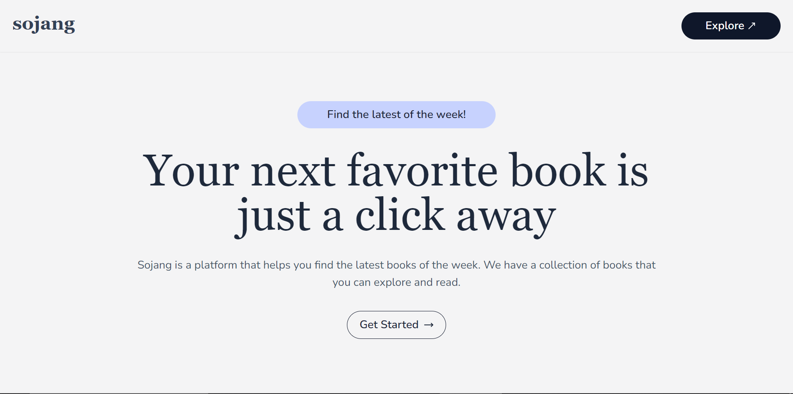

<h1 align="center">
  Sojang 🧾
</h1>

> **Sojang** (`소장`) - A collection of latest books of the week!. 
 

---

## Tools and Technologies 🛠️

**Frontend**
- **Framework**: Next.js 14 (React.js)
- **Language**: Typescript
- **Styling**: Tailwind CSS + Shadcn UI

**Backend**
- **Framework**:  Next.js Route Handlers (Node.js)
- **Language**: Typescript
- **Database**: Postgres (Vercel PG)
- **ORM**: Drizzle ORM
  
**Infrastructure**
- **Deployment**: Vercel
- **Database**: Vercel PG
- **Cron Jobs**: Vercel Cron Jobs

---

### Important Links 🌐
- [Frontend](./docs/FRONTEND.md)
- [URL](https://sojang.vercel.app/)

## Best Practices Followed 📝

- [x] Robust Error Handling
- [x] Conventional Commit Messages
- [x] Comments to help support complex code logic
- [x] Linting & Formatting
